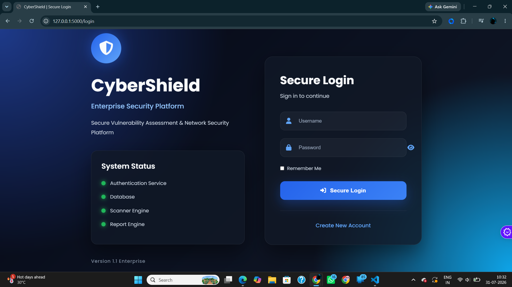
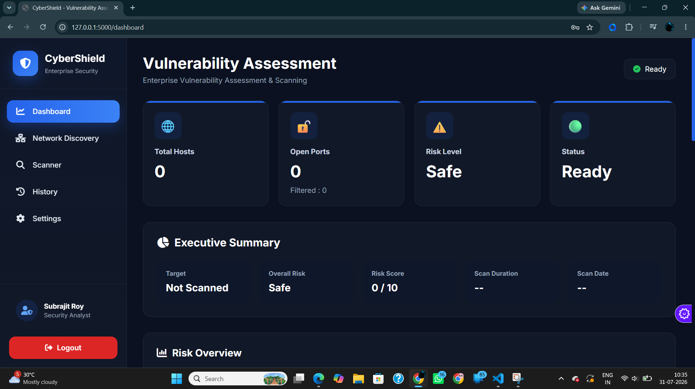
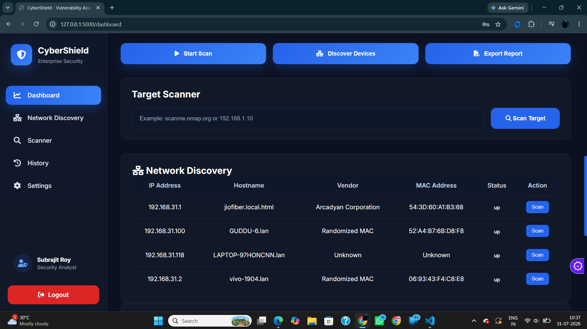
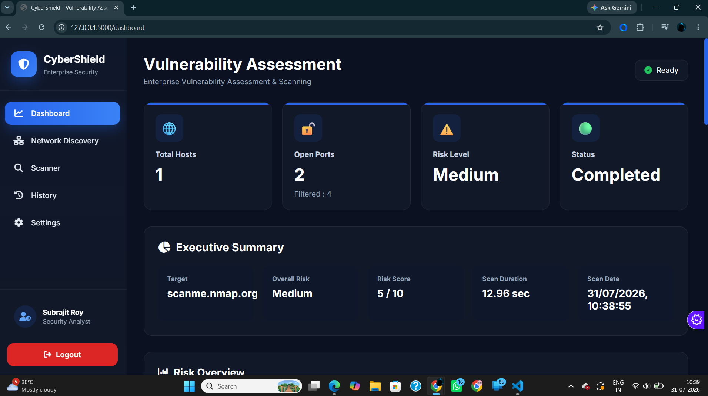
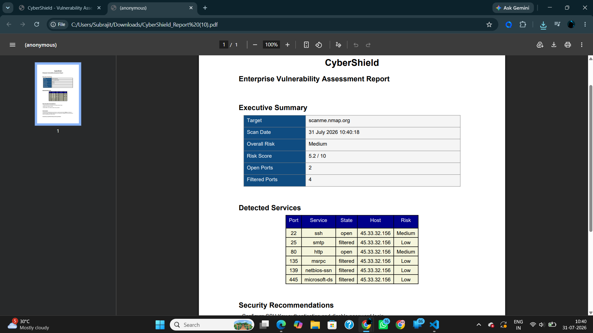
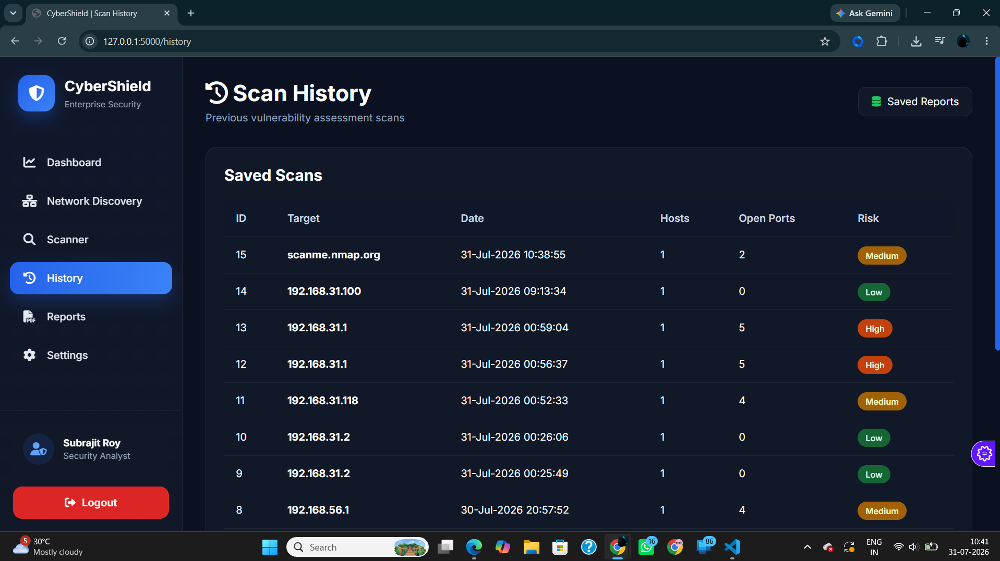

# 🛡️ CyberShield - Network Vulnerability Assessment & Device Discovery


CyberShield is a Python-based web application designed to discover devices on a local network, identify potential security risks, and generate professional vulnerability assessment reports. It provides an intuitive dashboard for network monitoring and helps users understand the security posture of their local network.

---

## 📌 Project Overview

CyberShield is developed using **Python (Flask)**, **Nmap**, **SQLite**, **HTML**, **CSS**, and **JavaScript**.

The application performs network discovery, vulnerability assessment, vendor identification, and report generation through a simple web interface.

---

## ✨ Features

### 🔐 User Authentication
- Secure Login & Registration
- Session Management
- Logout Functionality

### 🌐 Network Discovery
- Automatic Active Network Detection
- Device Discovery using Nmap
- Hostname Detection
- MAC Address Detection
- Vendor Identification using MAC Lookup API
- Online Device Detection

### 🔍 Vulnerability Scanner
- Fast Network Scan
- Service Detection
- Version Detection
- Open Port Detection
- Risk Assessment
- CVE Identification
- Security Recommendations

### 📊 Dashboard
- Overview of Discovered Devices
- Vulnerability Summary
- Scan Statistics
- Recent Scan History
- Security Status Overview

### 📄 Report Generation
- Generate Vulnerability Reports
- Export Scan Results
- Device Information Summary
- Risk Classification

### 🗂 Scan History
- Store Previous Scan Results
- View Historical Data
- Maintain Vulnerability Records

### ⚙️ Settings
- Scan Configuration
- Network Configuration
- Vendor Lookup Configuration
- Scan Preferences

---

# 🛠 Tech Stack

## Backend
- Python
- Flask
- SQLite
- Nmap
- Requests

## Frontend
- HTML5
- CSS3
- JavaScript

## APIs
- MAC Lookup API

---

# 📂 Project Structure

```text
CyberShield/
│
├── app.py
├── auth.py
├── database.py
├── scanner.py
├── report.py
│
├── network/
│   ├── discovery.py
│   ├── fingerprint.py
│   ├── inventory.py
│   ├── os_detection.py
│   ├── utils.py
│   └── vendors.py
│
├── templates/
│   ├── dashboard.html
│   ├── settings.html
│   ├── history.html
│   ├── reports.html
│   ├── login.html
│   ├── register.html
│   └── components/
│
├── static/
│   ├── css/
│   ├── js/
│   └── images/
│
└── requirements.txt
```

---

# ⚙️ Installation

## 1. Download the Project

Download or clone this repository from GitHub.

```bash
git clone https://github.com/subrajit77-svg/CODEVEDX.git
```

Navigate to the project folder:

```bash
cd Vulnerability-Assessment
```
```

---

## 2. Navigate to Project Directory

```bash
cd CyberShield
```

---

## 3. Create Virtual Environment

```bash
python -m venv venv
```

Activate Environment

### Windows

```bash
venv\Scripts\activate
```

### Linux

```bash
source venv/bin/activate
```

---

## 4. Install Dependencies

```bash
pip install -r requirements.txt
```

---

## 5. Install Nmap

Download and install Nmap:

https://nmap.org/download.html

Make sure Nmap is added to your system PATH.

---

## 6. Run the Application

```bash
python app.py
```

or

```bash
flask run
```

Open your browser:

```
http://127.0.0.1:5000
```

---

# 📸 Screenshots

## 🔐 Login Page



---

## 📊 Dashboard



---

## 🌐 Network Discovery



---

## 🔍 Vulnerability Scanner



---

## 📄 Reports



---

## 🗂 History



---

## ⚙️ Settings


---

# 🔍 How CyberShield Works

1. User logs into the application.
2. CyberShield automatically detects the active local network.
3. Nmap discovers all active devices.
4. MAC addresses are collected.
5. Vendor information is retrieved using the MAC Lookup API.
6. Each device is scanned for open ports and running services.
7. Risk levels are calculated based on discovered services and vulnerabilities.
8. Scan results are stored in the database.
9. Reports can be viewed or exported from the application.

---

# 📊 Risk Classification

| Risk Level | Description |
|------------|-------------|
| 🟢 Low | Minimal security concern |
| 🟡 Medium | Requires attention |
| 🟠 High | Significant security risk |
| 🔴 Critical | Immediate action recommended |

---

# 🎯 Learning Outcomes

This project demonstrates practical knowledge of:

- Python Programming
- Flask Web Development
- REST API Integration
- SQLite Database Management
- Network Scanning
- Cybersecurity Fundamentals
- Vulnerability Assessment
- HTML, CSS & JavaScript
- Software Architecture
- Backend Development

---

# 🚀 Future Improvements

- AI-assisted Vulnerability Analysis
- CVSS Score Integration
- PDF Report Export
- Email Notifications
- Scheduled Scans
- Docker Support
- Multi-user Access Control
- Real-time Monitoring Dashboard
- Advanced Network Topology Visualization

---

# 👨‍💻 Developed By

**Subrajit Roy**

BCA Student

CyberShield Internship Project

---

# 📄 License

This project is developed for educational and internship purposes.

---

# ⭐ Acknowledgements

- Flask
- Nmap
- SQLite
- MAC Lookup API
- Python Community